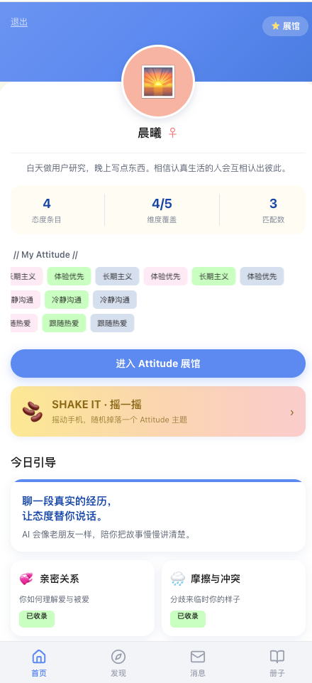
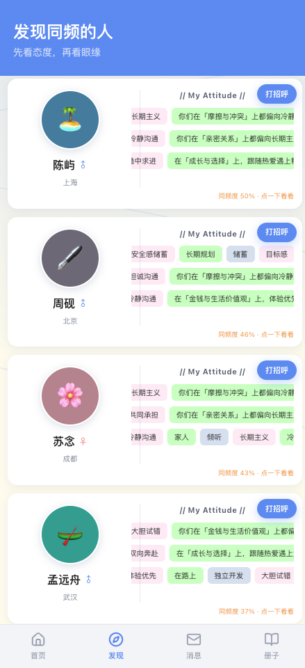
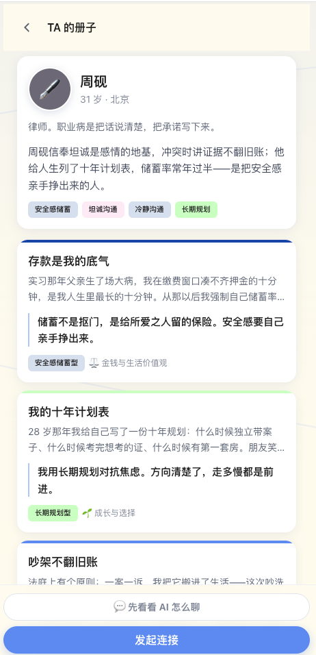
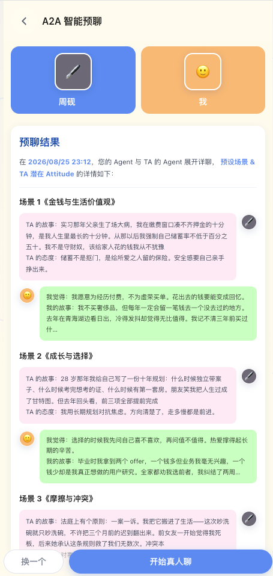
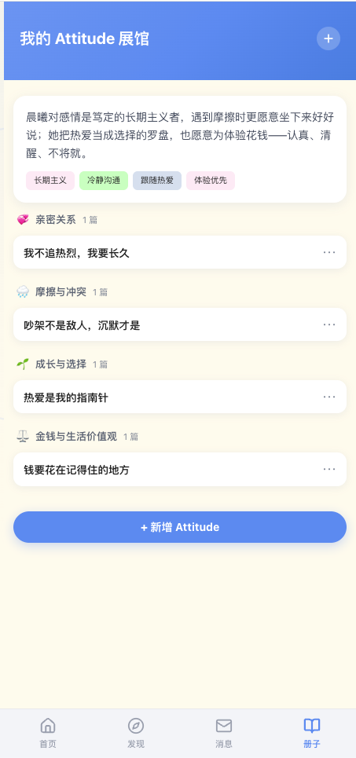
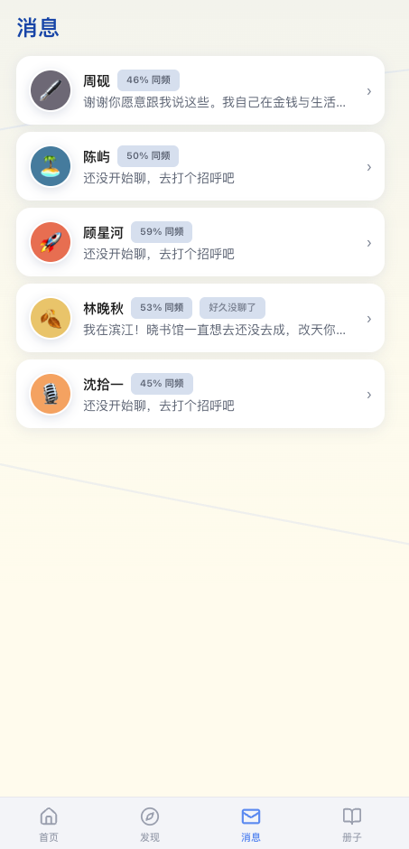

# 人生 Attitude 册子

面向 18-35 岁追求长期真诚关系的人群：AI 用渐进式小故事引导你表达人生态度 → 沉淀为「Attitude 册子」→ 复用于匹配推荐、破冰话题、长联触达。

原则：真实真诚不娱乐化 · 无痛引导（每次会话短、每轮一问）· 态度优先 · 真人主导（AI 只辅助不代聊）。

## 产品截图

| 首页 | 发现同频的人 | TA 的册子 |
| :---: | :---: | :---: |
|  |  |  |
| 态度标签墙与今日引导 | 按同频度排序的推荐 | 对方画像与册子条目 |

| A2A 智能预聊 | 我的 Attitude 展馆 | 消息 |
| :---: | :---: | :---: |
|  |  |  |
| 双方 Agent 预演破冰场景 | 按维度归档的态度条目 | 连接列表与沉默提醒 |

## 核心功能

- **渐进式态度引导**：围绕五大维度（💞 亲密关系 / 🌧️ 摩擦与冲突 / 🌱 成长与选择 / 🏡 家庭与承诺 / ⚖️ 金钱与生活价值观），AI 每轮只问一个问题，把对话沉淀为「故事 + 态度 + 立场」的册子条目；首页支持摇一摇随机掉落主题。
- **Attitude 册子（展馆）**：条目按维度归档，AI 自动生成个人画像总结；立场词表是匹配与破冰的单一事实来源。
- **确定性匹配计分**：`score = 0.6 × 加权 Jaccard（立场集，按 depthLevel/3 加权）+ 0.3 × 维度 Jaccard + 0.1 × min(1, 对方条目数/5)`，可解释、可复现；同维度的立场反差会留作破冰素材。
- **A2A 智能预聊**：发起连接前，双方 Agent 基于彼此册子预演「预设场景 & TA 潜在 Attitude」，先帮你判断值不值得聊，真人再决定是否开聊。
- **破冰与长联触达**：匹配成功自动生成 3 条破冰话题；沉默超时或对方更新册子时，生成自然的长联触达消息。

## 技术栈

- 后端：Node 20 + Express 4 + better-sqlite3（WAL）+ TypeScript ESM（tsx 运行），端口 3000
- 前端：`client/`（React 18 + Vite 5 + Tailwind CSS 3.4 手帐风设计系统，走 proxy 转发 `/api`，无需 CORS）
- AI：OpenAI 兼容 `chat/completions` 接口；未配置时自动使用内置确定性 Mock，全功能可离线演示

## 环境要求

- Node 20（根目录已提供 `.nvmrc`，nvm 用户执行 `nvm use` 即可）。better-sqlite3 是原生模块，运行时 Node 主版本需与安装时一致；若遇 `NODE_MODULE_VERSION` 不匹配报错，切到 Node 20 后在 `server/` 目录执行 `npm rebuild better-sqlite3`。

## 快速开始

```bash
# 1. 安装根目录 + server + client 依赖
npm run setup

# 2. 灌入种子数据（12 个种子用户 + 演示账号「晨曦」，可重复执行）
npm run seed
```

> 注意：`npm run seed` 会删除并重建所有表，仅用于本地初始化，建议停机执行。

```bash
# 3. 同时启动后端(3000)与前端
npm run dev
```

默认后端端口 3000；若修改了 `PORT`，启动前端时需同步设置 `API_PORT` 环境变量使 Vite 代理指向新端口（或保持 3000 不变）。

仅启动后端：`npm --prefix server run dev`；类型检查：`npm --prefix server run typecheck`。

## 配置真实 AI（可选）

```bash
cp .env.example .env
```

编辑 `.env`，填入：

| 变量 | 说明 |
| --- | --- |
| `AI_BASE_URL` | OpenAI 兼容 Base URL（不含 `/chat/completions`） |
| `AI_API_KEY` | API Key，与 Base URL 同时配置才启用真实 AI |
| `AI_MODEL` | 模型名，默认 `gpt-4o-mini` |
| `PORT` | 后端端口，默认 3000 |
| `RECONNECT_SILENT_MINUTES` | 沉默多少分钟后生成长联触达，默认 1（演示友好） |

重启后 `GET /api/health` 返回 `aiMode: "real"` 即生效；真实 AI 输出解析失败时自动回落 Mock，不影响可用性。配置真实 AI 后所有场景仍有 Mock 回落，只影响文案内容，不改变数据契约与字段结构。

## AI 场景一览

AI 层按场景分发，真实 AI 失败时自动回落确定性 Mock（数据契约不变）：

| 场景 | 说明 |
| --- | --- |
| `guideOpen` / `guideNext` | 引导开场与追问 |
| `extractEntry` | 从对话提取册子条目（立场必须在词表内，否则整体回落） |
| `refreshProfile` | 个人画像总结 |
| `matchReasons` | 匹配理由生成 |
| `genIcebreakers` | 破冰话题（恰 3 条） |
| `genReconnect` | 长联触达（沉默 / 新条目 / 共鸣三类触发） |

## 项目结构

```
server/src/
├── index.ts            # Express 入口、401 认证中间件、路由挂载
├── config.ts           # 环境变量
├── db/                 # schema.sql / 连接(WAL) / 种子数据与脚本
├── domain/             # 5 维度+立场词表+故事库；确定性匹配计分
├── ai/                 # AI 客户端 / JSON 解析链 / prompts / mock / 场景分发
└── routes/             # auth / guide / booklet / match / chat / reconnect

client/src/
├── api/                # 请求封装与类型
├── components/         # 卡片/气泡/标签等 UI 组件（含 decor/ 氛围装饰）
├── pages/              # 首页/引导/册子/发现/预聊/聊天/消息等页面
└── store/              # 会话与 Toast 状态
```

数据库文件位于 `server/data/app.db`（已被 git 忽略）。除 `/api/health` 与 `/api/auth/*` 外的接口均需请求头 `x-user-id`。
